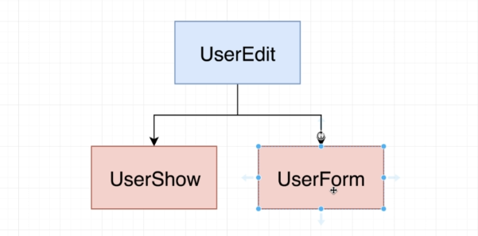

# web-framework-with-ts

We have two classes

- Model Class : handles the data and resources
- View Class : responsible for producing HTML and showing that to the user. It's also going to be responsible for handling events caused by the user


## Models

<b>Extraction approach</b> : The general idea behind this approach is to build something specific and then pulling something reusable out of it; which you might refer to as like an extraction approach.

So we're trying to build up something specific application to represent a user, and then we're going to extract some reusable library out of it.


### Implementation Rules - User


### On - Click event Listner

The On function takes two arguments :

- EventName : string
- callBack : function

Whenever the User triggers a event with a particular name, we'll add it to the array.

So the keys of this object are going to be event names, then the values are going to be arrays that store all the different callbacks that have been registered for each of these different events.

So in other words, if some other developer makes use of our user and they call on with an event name of click and then pass in some callback and then do the exact same thing a second time, we're going to take both the callbacks they pass in and we're going to add them to an array.

Where the click property inside this object points out that array, when we eventually decide to trigger the click event, we will iterate through this array and call each of those callback functions.

This is a pretty standard eventing style set up right here, so you'll actually see this kind of implementation with many other styles of eventing libraries in JavaScript as well.


### Trigger

Whenever the user triggers the event with the eventName, all the callbacks in the particular event array gets executed.

### Fetch and Save

Axios is used to make a call to fetch the data from the JSON placeholder and save the data in the local db regarding the same.

During saving the User details to the db, If the User object has an ID, PUT request is made, else POST


## Composition - Event class

Goal here through using composition is to have our class user in rather than having a ton of methods inside of it.

We want to have a couple of different properties that class user can use to delegate out some very important operations.

For example, here we just extract it out an Eventing class, and now we want to eventually assign it back to it as maybe some property on classes are called events.

And then hopefully we will eventually have some attributes, property and sync property to take care of handling properties tied to the user and take care of all that server saving stuff and whatnot as well.


- ### Ways to wire Events class back to User

  - Accept dependencies as second constructor argument

    ```
     class User {
         constructor(data : UserProps, events : Eventing){ }
    }

    new User({name : 'Reed'; age: 67}, new Eventing())
    ```

  - Only accpet depedencies into constructor. Define a static class methods to preconfigure the User and assign the properties afterward [composition style approach] (the dependency can be easily swapped with other object)

    ```
    class User {
        static fromData(data : UserProps) : User {
            const user = new User(new Eventing())
            user.set(data)
            return user;
        }
        private data : UserProps;
        constructor(private events : Eventing){ }
    }

    new User.fromData({name: "Quill", age: 78})
    ```

  - Only accept properties into the constructor. Hard code dependencies as properties [Sub module]

    ```
    class User {
        events : Eventing = new Eventing()

         constructor(data : UserProps){ }

    }

    const user = new User({name : "Trevor" , age : 34})
    user.events.on('click', ()=> {}) // EXISTS
    ```

## Composition - Sync class

When the User class gets the call to save the user data, this function call is <b>delegated</b> to the Sync class. Here compositions is used through delegation.

So class user is going to delegate the save request to the Sync class. The expectation is that we are going to take some data from the User and save it to our outside API.


- ### Ways to wire Sync class back to User

  - Sync gets the function arguments. class user is going to pass all the current data properties over to save, along with some ID to use as well.

  So in other words, the sync is saying class is going to get some function arguments of the ID that we're trying to save this record as in the actual data to save to that outside server.

  

  Downside is that, now Sync is configured only to work with the User class.

  - We could try setting up class sync to also define to interfaces, maybe an interface called Serializable and an interface called Deserializable.

  

  So the idea behind Serialize is that some other class or some other object would have to implement this
  serialized method any time Serialize gets called that other class.

  So in this case, our user would have to return some kind of object. Like we're not going to specifically say any here. We can at least say, like, you have to return an object.

  Now, the reason we're saying, just like some object right here, is to intentionally leave this vague.

  

  - Convert Sync to a generic class. This customizes the data coming into the save() function.

  

The idea with delegation is that our class user is still going to have all these same properties where all the same methods and the color is going to call those methods.

And then inside of the method, save our user class is going to use these different sub modules to actually implement some behavior, so save isn't really being done by class.

There are two types of refactoring needed in these methods


- Direct pass-through of arguments:
  every single time we want to pass through some function call or pass through some method call, we're going to have to first look up what different properties are expected by this on function and we're going to have to manually type them all out right here.

  So that is definitely not ideal, this approach right here. Now, we probably don't want to do that.

  So, we're going to instead try using a getter, the idea with this getter is that anytime someone references the on property on an instance of user, we're going to directly return the UN function from this events.

  So we're not going to try to call on. That's not the goal here with this Gitter The goal is just to return a reference to the on method on events.

  

- Need coordination between different modules in User:
  Sometimes, we need to use two or more methods in the class to complete a simple task. Here we create another method and use those function call to implement the entire task

  For example, if we want to log a statement everytime we save the data, we can use the fetch function and then trigger "save" function after it. All in the same function.

  

Generalize the class. Extract Model class from the user.

<b>But this will lead to methods which will be having user.model.methodName() for few functions and user.methodName() for other functions. Which results in inconsistency. Hence "COMPOSITION" isn't recommended here.</b>


### Extend User class with Model Class Instead


Any additoinal method/functionality can be added to that class by extending Model Class using Inheritance

### View Model

Enable HTML editing in the webpage. It has two classes which extend UserEdit class and are tightly coupled.



### View Class


Render the template strings


A document fragment is essentially an object that can contain a reference to a fragment of HTML document. Generally, its purpose is to hold some HTML inside the memory before it gets attached to the DOM.


